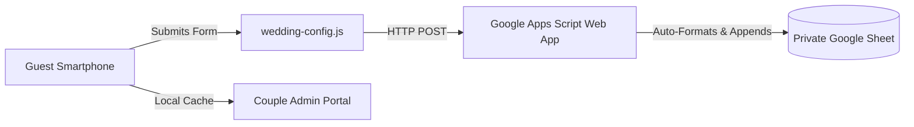

# 📊 Reusable Google Sheets RSVP Integration Guide
### Luxury Digital Wedding Invitation Template Suite

This document explains how the Google Sheets RSVP integration works as an **independent, reusable commercial product**. It is completely decoupled from any single Google account or wedding name, making it easy to deploy for yourself or reconfigure when selling the template to another customer.

---

## 🏗️ Architecture Overview



- **100% Serverless & Zero Running Cost**: No monthly database or server subscription.
- **Complete Privacy & Security**: Credentials, API keys, and Google accounts are **NEVER** exposed in client-side code.
- **Independent Ownership**: Each client or buyer uses their own Google Sheet under their own Google account.
- **Deduplication Engine**: If a guest resubmits with the same name, their existing spreadsheet row is updated in-place rather than creating duplicate headcounts for caterers.

---

## ⚡ 3-Minute Setup for a New Customer / Wedding

When deploying for a new wedding, follow these 3 steps:

### Step 1: Create the Client's Google Sheet
1. Navigate to **[sheets.new](https://sheets.new)** in any browser.
2. Title the spreadsheet: `[Couple Names] — Wedding RSVPs` (e.g. `Amelia & Ethan — Wedding RSVPs`).
3. *(Optional)* You can leave the sheet completely blank! The script automatically generates and formats all 9 luxury header columns on the first submission.

### Step 2: Deploy the Google Apps Script Receiver
1. In Google Sheets top menu, click **Extensions ➔ Apps Script**.
2. Delete any default code in the editor.
3. Open [`google_sheets_rsvp_backend.gs`](file:///c:/Users/amith/Desktop/New%20folder%20(6)/google_sheets_rsvp_backend.gs) in this project folder, select all, copy, and paste it into the editor.
4. In the upper right corner, click **Deploy ➔ New deployment**.
5. Click the gear icon ⚙️ next to "Select type" and choose **Web app**.
6. Set the fields:
   - **Description**: `Wedding RSVP Webhook`
   - **Execute as**: `Me (your email)`
   - **Who has access**: `Anyone` *(Crucial: allows invited wedding guests to submit their RSVP without requiring a Google sign-in)*
7. Click **Deploy**, click **Authorize access**, and approve the script under your Google account.
8. Copy the **Web App URL** (format: `https://script.google.com/macros/s/AKfycb.../exec`).

### Step 3: Connect to the Invitation Template
1. Open [`wedding-config.js`](file:///c:/Users/amith/Desktop/New%20folder%20(6)/wedding-config.js) in your project root.
2. Paste the Web App URL into `googleSheetWebhookUrl`:
   ```javascript
   window.WEDDING_CONFIG = {
     rsvp: {
       googleSheetWebhookUrl: "https://script.google.com/macros/s/AKfycb.../exec",
       deadlineText: "Kindly Respond by April 15"
     }
   };
   ```
3. Save the file. **You're done!**

---

## 📋 Data Fields Stored in Google Sheets

Each submission automatically maps to 9 organized columns:

| Column | Header | Description |
| :--- | :--- | :--- |
| **A** | `Submission Date` | Timestamp of submission (`YYYY-MM-DD HH:MM:SS`) |
| **B** | `Guest Name` | Full name(s) entered by the guest |
| **C** | `Attendance Status` | `Attending` or `Declined` |
| **D** | `Party Size` | Headcount (1 to 4 if attending, 0 if declined) |
| **E** | `Entrée Preference` | Selected dinner option (or `N/A` if declined) |
| **F** | `Phone / Email` | Contact information provided by guest |
| **G** | `Theme Selected` | Which visual theme was active (`Blush`, `Emerald`, `Editorial`, `Midnight`) |
| **H** | `Message to Couple` | Personal message, dietary notes, or song requests |
| **I** | `Status` | `Initial RSVP` or `Updated RSVP` |

---

## 🧪 Testing & Verification Checklist

To verify your integration end-to-end:
1. **Health Check**:
   - Open your Web App URL in a web browser.
   - You should see a JSON response: `{"status": "online", "spreadsheetName": "...", "totalResponsesRecorded": 0}`.
2. **Test Submission**:
   - Open [`index.html`](file:///c:/Users/amith/Desktop/New%20folder%20(6)/index.html) or any standalone theme.
   - Fill in a test name (e.g. `Eleanor Vance`), select an entrée, and click **Confirm Attendance**.
   - Watch the instant confirmation screen appear.
   - Switch to your Google Sheet: the new row will appear with headers automatically created!
3. **Test Deduplication**:
   - Re-submit with the same name and a changed meal choice.
   - Verify that the existing row in Google Sheets updates in-place without duplicating the row.

---

## 🔁 Selling or Reusing for Another Client

To hand this product to a new customer:
1. Deliver the project folder containing `wedding-config.js`, the HTML files, and `google_sheets_rsvp_backend.gs`.
2. Give the customer this guide (`SPREADSHEET_SETUP_GUIDE.md`).
3. The customer simply pastes their own Google Apps Script Web App URL into `wedding-config.js` and customizes couple names and dates in that same single file.
